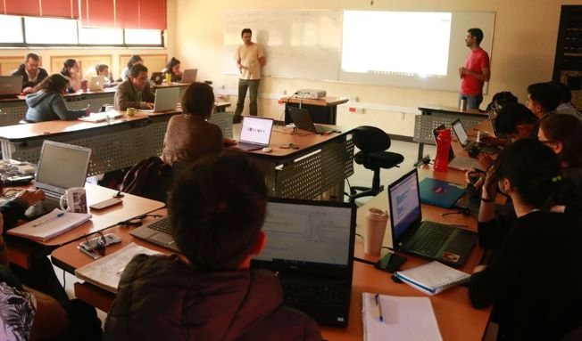

El objetivo de la escuela de métodos es proveer métodos y técnicas actualizadas para el análisis cuantitativo de datos y el análisis cualitativo de la información. Para ello se imparten talleres de capacitación en métodos y herramientas específicas, impartidos por expertos nacionales e internacionales. En ellos se hace énfasis en el uso de herramientas de acceso libre, particularmente del lenguaje R.
Producción de materiales didácticos sobre los métodos presentados en los talleres, que faciliten su implementación en docencia e investigación.

 [Visitanos en nuestro sitio web](https://www.facebook.com/escuelademetodosunam/)
 

Los cursos de las ediciones pasadas son: 

### 2017:
 + Introducción al lenguaje R
 + Análisis de redes complejas aplicadas a la ecología usando R
 + Herramientas para el análisis cualitativo en las ciencias sociales
 + Análisis de dependencia y autocorrelación espacial

### 2018
 + Lenguaje R: Nociones básicas para el manejo de bases de datos.
 + Introducción al diseño y manejo de bases de datos: una aproximación desde MySQL y R.
 + Modelos lineales generalizados en R
 + Modelos no lineales en R
 + Modelos lineales mixtos y generalizados para ecólogos

### 2019
 + Visualización y gestión de datos y generación de reportes con Tidyverse y RMarkdown

### 2020
 + Introducción al lenguaje R.
 + Foto-trampeo en R: Organización y análisis de datos
 + Herramientas para el análisis longitudinal en Ciencias Sociales
 + Introducción a SIG con QGIS 2020

