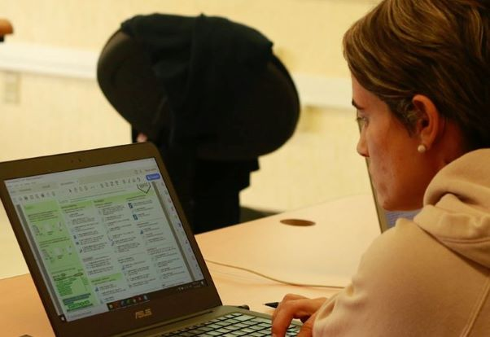

La unidad da asesoría a estudiantes y académicos del [IIES](https://www.iies.unam.mx/) en áreas como:
+ El diseño de experimentos y muestreos.
+ La estructuración de tablas y bases de datos.
+ La implementación de análisis y modelos estadísticos.
+ La visualización adecuada de la información.

Para solicitar una asesoría por favor envía una solicitud por [correo electrónico](#contacto).

