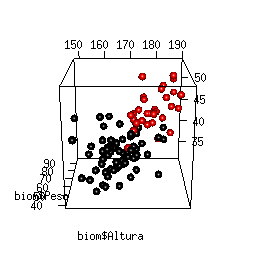

#

Uno de los [tres ejes principales de la unidad de apoyo](/ejes) es proveer asesoria a estudiantes e investigadores del [IIES](https://www.iies.unam.mx/) en el planteamiento del diseño experiental de sus proyectos de investigación que cumplan con criterios estadísticos robustos. 

Una vez obtenidos los datos, la unidad apoya en la exploración de datos, aplicación de análisis estadísticos y modelación con el fin de obtener resultados confiables que consideren supuestos estadísticos y análisis empleados actualmente en el estudio de los sistemas ecológicos.

Adicionalmente, incorporando librerias y herramientas de vanguardia para la visualización y presentación de resultados, buscamos que la comunidad del IIES comunique los resultados de sus investigaciones de forma precisa e interesante.

#

Actividades:

  - **Planteamiento del diseño experimental de proyectos de investigación**
  - **Análisis de datos y modelación**
  - **Visualización y presentación de resultados estadísticos**

 
