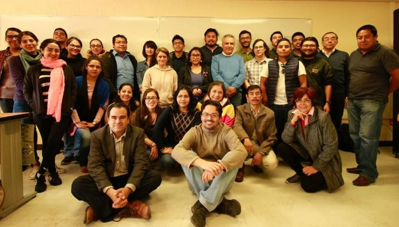
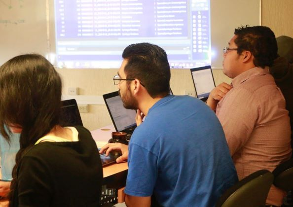

La unidad trabaja de manera permanente en el diseño e implementación de cursos, talleres y foros
de discusión dirigidos a fortalecer las capacidades de la comunidad académica para el manejo y
análisis de datos.

En particular, la unidad ofrece:

1. Cursos en las licenciaturas de Ecología y Ciencias Ambientales de la ENES Morelia
     + Ecología de Comunidades: métodos y Herramientas
     + Modelación Estadística

2. Cursos del posgrado en Ciencias Biológicas de la UNAM
     + Introducción al lenguaje R
     + Diseño experimental y modelado estadístico en ecología
     + Métodos multivariados

3. Talleres cortos de la [Escuela de Métodos](/cursos/escuela-de-metodos)

4. Sesiones de discusión y apoyo conjunto a través del proyecto [VieRnes de código](/proyectos/viernes-de-codigo)

Para ver una lista completa de los cursos ofrecidos de [(click aquí)](/cursos).

