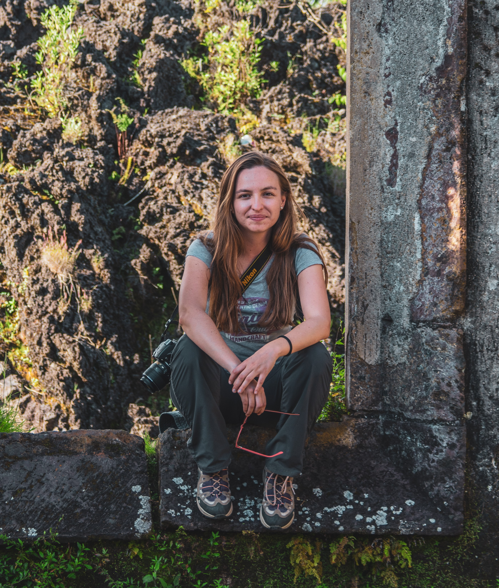

---
authors:
- admin
categories: []
date: "2020-04-20T00:00:00Z"
draft: false
featured: false
image:
#  caption: ''
  focal_point: "Center"
  preview_only: true
lastmod: "2019-04-17T00:00:00Z"
projects: []
subtitle: 'Técnico de proyecto'
summary: Técnico de proyecto
tags:
- Tecnico de proyecto
title: 'Nathalia Pérez'
---

Soy maestra en ciencias del Instituto de Investigaciones en Ecosistemas y Sustentabilidad (IIES) y actualmente apoyo actividades de docencia, manejo de datos y difusión de la información en la Unidad de Apoyo en Estadística y Manejo de Datos de IIES.

Me interesa investigar los diferentes factores que afectan la regeneración de los bosques tropicales secundarios. En la actualidad investigo el efecto del paisaje y el manejo agropecuario sobre la sucesión secundaria en paisajes antropizados. Tengo un especial interes en el estudio de factores a diferentes escalas espaciales y temporales.

### 1.  Intereses
 * Sucesión secundaria en paisajes antropizados
 * Regeneración de bosques tropicales
 * Ecología y manejo del paisaje

Puedes consultar mi página personal [aquí](https://nathaliaperez.netlify.app/) y
[mis publicaciones aquí](https://www.researchgate.net/profile/Nathalia_Perez_Cardenas) [.

